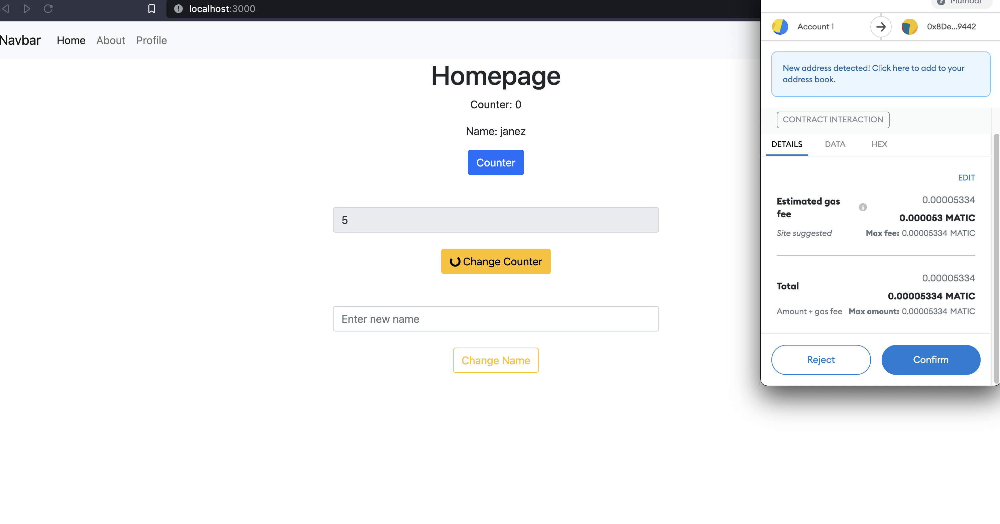

# Counter storage

#### First Dapp Project



<hr>
# Vue 3 Dapp Starter

Forked from [chnejohnson/vue3-dapp-starter](https://github.com/chnejohnson/vue3-dapp-starter) and adapted to use either TS or JS, and with examples without the script setup syntax. Also, Bootstrap instead of Windi CSS.

## Quickstart

```bash
npm install
npm run dev
```

## Features

- [Vue 3](https://v3.vuejs.org/guide/introduction.html#what-is-vue-js) as the foundation
- [Bootstrap](https://getbootstrap.com) for styling
- [Vite](https://vitejs.dev/guide/) for faster builds
- [ethers.js](https://docs.ethers.io/v5/) for interacting with Ethereum
- [vue-dapp](https://github.com/chnejohnson/vue-dapp) for the wallet connect

## Strict TypeScript disabled

In `tsconfig.json` the `strict` field is set to false, which means you can use plain JS in
the project.

## Recommended IDE Setup

- [VSCode](https://code.visualstudio.com/) + [Volar](https://marketplace.visualstudio.com/items?itemName=johnsoncodehk.volar)

## Type Support For `.vue` Imports in TS

Since TypeScript cannot handle type information for `.vue` imports, they are shimmed to be a generic Vue component type by default. In most cases this is fine if you don't really care about component prop types outside of templates. However, if you wish to get actual prop types in `.vue` imports (for example to get props validation when using manual `h(...)` calls), you can enable Volar's `.vue` type support plugin by running `Volar: Switch TS Plugin on/off` from VSCode command palette.
